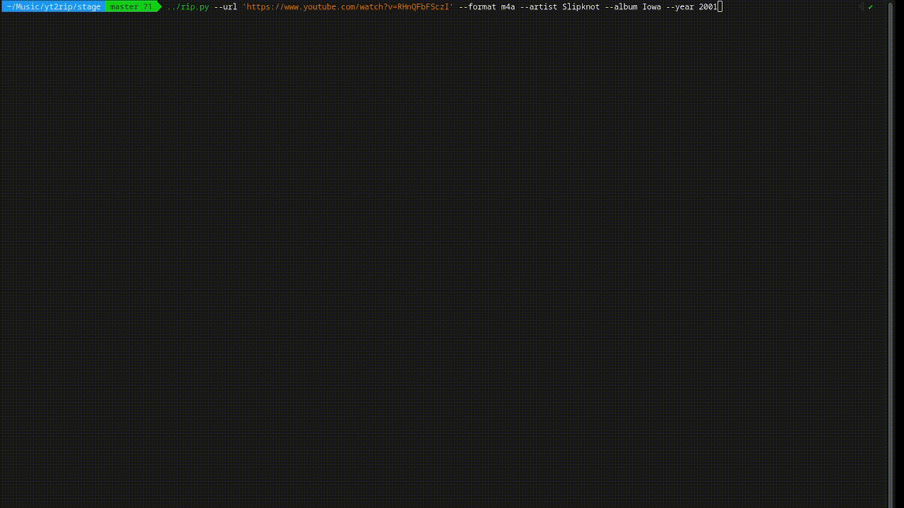

# Description

Downloads a single URL from Youtube (an album) and splits into multiple tracks (or videos).
If the source video doesn't have embedded JSON chapters, the option is presented to search through
the top-comments and look for an entry containing the timestamps of each track. The user can post-process
the comment through the default text $EDITOR incase there are abnormalities.
The title, artist, album, year, and track number are injected into the metadata of output file.

# Requirements

Install via package manager:
```
python3, yt-dlp, ffmpeg, ffprobe, mp4art, atomicparsley

```

Install via pip:
```
youtube-comment-downloader
```

# Usage

```
cd youtube-rip/stage
rm -rf *
../rip.py --url https://www.youtube.com/watch?v=RHnQFbFScz --format m4a --artist Slipknot --album Iowa --year 2001
```


